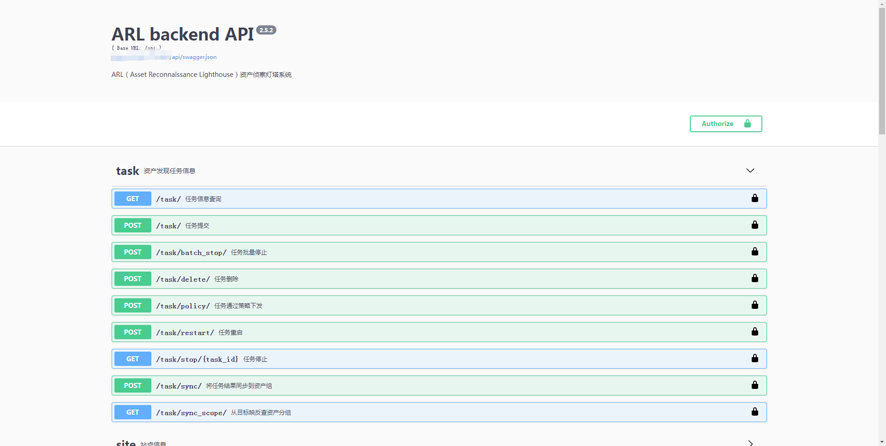

可以先在文件 `config-docker.yaml` 中对 `ARL.API_KEY` 配置选项设置一个`Token`, 如果设置了请注意保密。
访问API的时候token 设置在`Query`中和Header中的效果是一样的。

访问 https://127.0.0.1:5003/api/doc 可以查看文档， 点击右上角的 `Authorized` 按钮可以设置自己的`Token`，这样可以在浏览器中进行调试。

