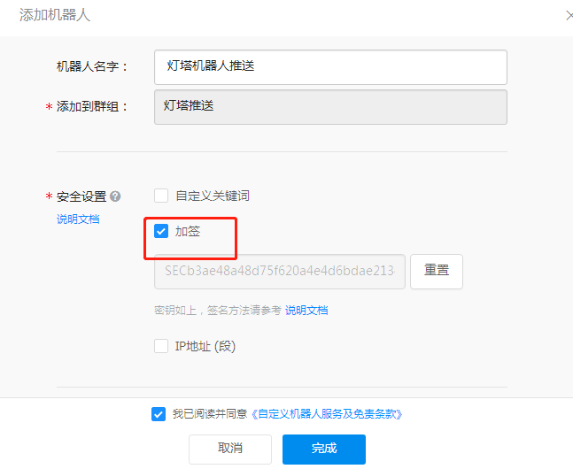
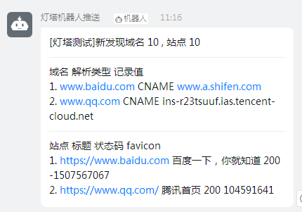
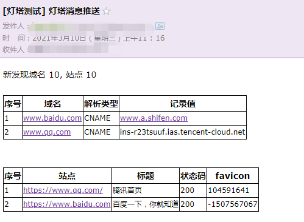
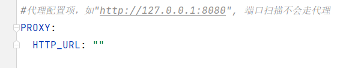

Docker环境配置文件路径 docker/config-docker.yaml


| 配置 | 说明 |
| --- | --- |
| CELERY.BROKER_URL | rabbitmq连接信息 |
| MONGO | mongo 连接信息 |
| QUERY_PLUGIN | 域名查询插件数据源Token 配置 |
| GEOIP | GEOIP 数据库路径信息 |
| FOFA | FOFA API 配置信息 |
| DINGDING | 钉钉消息推送配置 |
| EMAIL | 邮箱发送配置 |
| GITHUB.TOKEN | GITHUB 搜索 TOKEN |
| ARL.AUTH | 是否开启认证，不开启有安全风险 |
| ARL.API_KEY | arl后端API调用key，如果设置了请注意保密 |
| ARL.BLACK_IPS | 为了防止SSRF，屏蔽的IP地址或者IP段 |
| ARL.PORT\_TOP\_10 | 自定义端口，对应前端端口测试选项 |
| ARL.DOMAIN_DICT | 域名爆破字典，对应前端大字典选项 |
| ARL.FILE\_LEAK\_DICT | 文件泄漏字典 |
| ARL.DOMAIN\_BRUTE\_CONCURRENT | 域名爆破并发数配置 |
| ARL.ALT\_DNS\_CONCURRENT | 组合生成的域名爆破并发数 |
| PROXY.HTTP_URL | HTTP代理URL设置 |
| QUERY_PLUGIN | 域名插件选项配置 |


### 通过钉钉/邮箱进行资产监控任务结果推送
#### 1.添加机器人
使用下面的步骤添加钉钉机器人 【电脑钉钉 】-【群聊】-【群设置】-【智能群助手】-【添加更多】-【添加机器人】-【自定义】-【添加】

其中安全设置勾选加签，并保存SEC开始的字符串

点击完成将Webhook 地址保存，

#### 2.修改配置文件
修改docker/config-docker.yaml 文件, 将 DINGDING->SECRET 配置为SEC开头的字符串 将DINGDING->ACCESS_TOKEN 配置为Webhook地址中的access_token值

邮箱配置示例， 由于25端口可能被云厂商封禁，请使用465（ssl）端口
```
EMAIL:
  HOST: "smtp.qq.com"
  PORT: "465"
  USERNAME: "yourname@qq.com"
  PASSWORD: "youpassword"
  TO: "youname@qq.com"   ##接收邮箱
```

#### 3.测试和重启
执行下面的命令，如果配置正常的话将会收到邮箱和钉钉推送

```
docker-compose exec worker bash
python3.6 -m test.test_utils_push
```

如果测试没问题的话，记得执行下面的命令重启让应用生效
```
docker-compose restart
```

#### 4.测试效果图


#### 5. 邮箱测试效果图


### 监控任务自定义 WEBHOOK 功能
可以在`config-docker.yaml` `WEBHOOK`选项下配置

IP/域名监控和站点监控结束后会往配置的webhook URL POST提交JSON数据

为了验证身份会在Header中带上Token 字段, 接收方可以验证Token字段是否符合预期

进入容器测试 `docker-compose exec worker bash`

测试命令 `python3.6 -m test.test_webhook <task_id> <scope_id>`

如果没有传递source参数，那么就会全部测试。

测试完毕后重启容器生效。


#### 代理配置项
如果为空表示不配置代理。 在docker/config-docker.yaml 配置选项添加了HTTP_URL配置选项， 重启容器生效。 测试配置是否正常工作
```
docker-compose exec worker bash
python3.6 -m test.test_proxy_url
```


### 域名查询插件选项
在添加任务选项框中有一个域名查询插件选项，目前已支持的数据源为12个 

`alienvault`, `certspotter`,`crtsh`,`fofa`,`hunter`,`passivetotal`,
`quake`, `rapiddns` `securitytrails`,`threatminer`,`virustotal`, `zoomeye`

相关代码可以在这里查看 [dns_query_plugin](https://github.com/TophantTechnology/ARL/tree/master/app/services/dns_query_plugin)

由于部分数据源需要配置`Token`,可以在`config-docker.yaml` `QUERY_PLUGIN`选项下配置

可以通过enable字段来控制是否启用。

### 测试Token有效性

进入容器测试 `docker-compose exec worker bash`

测试命令  `python3.6 -m test.test_query_plugin [source1] [source2]`

如果没有传递source参数，那么就会全部测试。

测试完毕后重启容器生效。
