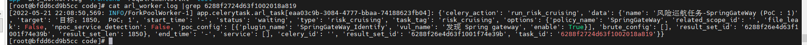
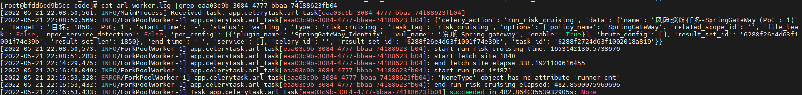
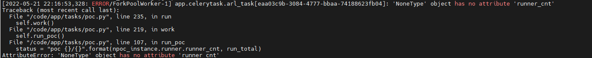

### 1. 密码忘记了怎么办？
可以执行下面的命令，然后使用admin/admin123就可以登录了。

```
docker exec -ti arl_mongodb mongo -u admin -p admin
use arl
db.user.drop()
db.user.insert({ username: 'admin',  password: hex_md5('arlsalt!@#'+'admin123') })

```

### 2. 如何修改任务并行数量？
修改下面文件43行中的 -c 参数即可，默认为2, 重启容器生效。 
[https://github.com/TophantTechnology/ARL/blob/master/docker/docker-compose.yml#L43](https://github.com/TophantTechnology/ARL/blob/master/docker/docker-compose.yml#L43)

### 3. 运行出现异常？
可以执行下面的三条命令并尝试触发错误观察输出有什么异常。

```
docker-compose ps
docker-compose logs -f  --tail=10
tail -f *.log
```

### 4. 容器一直重启，查看日志提示权限错误

排查下宿主机是否开启了`selinux` , 将`selinux`功能关闭即可。

### 5. Docker 环境的 ARL 如何升级更新？
先手动更新`config-docker.yaml`和 `docker-compose.yml`
docker-compose pull 是为了更新镜像， 如果碰到问题可以排查是否使用了三方镜像源。

```
docker-compose down
docker-compose pull
docker-compose up -d
```

### 6. 任务结果为什么只有域名和IP结果？
可能任务下发时开启了全端口扫描，对于金融、银行存在防护设备的情况大量端口扫描、服务报文探测会出现异常。
可以选择Top 10端口扫描，或者关闭端口扫描，将只会探测80,443端口。

### 7. 如何判断任务是否还在运行
1). 任务状态长时间没有改变，并且后下发的多个（大于等于2）任务都已经执行了，当前任务肯定是异常了。
2). 根据下面的异常任务原因排查看任务日志是否有持续输出。
3). 根据网络带宽，CPU，内存占用情况判断任务是否还在运行。

### 8. 异常任务原因排查
一般错误异常到会写入到 arl_worker.log 日志中
下面是一个简单的例子.

1). 先在后台找到Task ID
    cat arl_worker.log | grep 6288...
    

2). 可以找到对应的Celery ID
    cat arl_worker.log |grep eaa03c9b-3084-4777-bbaa-74188623fb04
    

3). 再找到详细的堆栈错误信息 cat arl_worker.log |grep -A 20 "has no attribute"


### 9. 使用全端口扫描一直停在端口扫描阶段
可以从arl_worker.log，nmap进程是否还在，出网流量等外部状态判断任务是还在运行还是已经结束了。
如果任务没有在运行了，并且查看docker ps 发现容器重启过了，可能是大量端口扫描导致的docker 网卡出现了异常，任务被关闭了，但是任务状态并没有感知到。 
如果确切有全端口扫描的需求，可以使用源码安装的方式运行ARL

### 10. 任务结果域名很多，但是站点数却没有

1. 可以在IP选项卡中观察端口结果，如果一个都没有可能是扫描过程中被拦截了，端口扫描选项可以不勾选再测试或者端口扫描类型使用测试选项。
2. 可以在IP选项卡中观察IP归属地选项，大部分是一些国外的IP, 域名是国内厂商可能被神秘力量干扰了。


### 11. Docker 环境如何卸载并重装
如果忘记了原先的启动目录可以使用下面的命令进行容器停止和删除
```shell
docker stop arl_web
docker stop arl_worker
docker stop arl_scheduler
docker stop arl_rabbitmq
docker stop arl_mongodb
docker rm arl_web
docker rm arl_worker
docker rm arl_scheduler
docker rm arl_rabbitmq
docker rm arl_mongodb
docker rmi tophant/arl:latest
```

#### 卸载
```shell
docker-compose down
docker rmi tophant/arl:latest
docker volume rm arl_db （不执行这个可以保留mongo中的数据）
```
再删除当前目录的文件就可以。

#### 重装
```shell
cd /opt/
mkdir docker_arl
wget -O docker_arl/docker.zip https://github.com/TophantTechnology/ARL/releases/download/v2.6/docker.zip
cd docker_arl
unzip -o docker.zip
docker-compose pull
docker volume create arl_db
docker-compose up -d
```

### 12. 如何修改 ARL-NPoC 的弱口令爆破字典

1. 进入 worker 容器
```shell
docker exec -it arl_worker bash
```

2. 字典目录
```shell
ls -alh /opt/ARL-NPoC/xing/dicts
```

### 13. 大量 IP 全端口扫描结果很少或者为空

1. 可能是扫描过程中被防火墙拦截了
2. 检查下系统的 Open File Limit 是否是默认的 1024，如果是的话，可以调大一点，比如 65535

### 14. 子域名扫描结果不理想

1. 检查操作系统 DNS 服务器是否正常，可以使用 dig 命令测试下
2. 检查灯塔系统内置 DNS （app/dicts/dnsserver.txt） 否正常，可以使用 dig 命令测试下
3. 宿主机带宽是否正常，可以使用 speedtest-cli 测试下
4. 大量任务同时执行，可能会导致 DNS 服务器拒绝服务，可以调整任务并发数为 1

