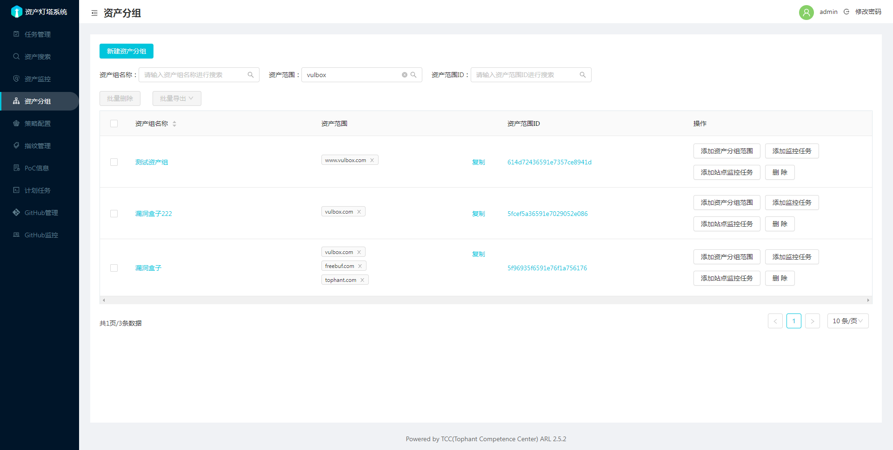

资产分组页面显示的是资产分组数据，通过新建资产分组操作进行资产分组创建。

类别可以选项IP或者域名，IP一般写地址段，域名一般写主域名就可以。

刚新建的资产分组是不包含任何资产的可以通过任务管理页面的同步操作来添加数据或者直接添加监控任务，每一次监控任务都只显示资产分组中没有的数据，如果已经存在了将不会显示。

1. 新建资产分组范围操作，可以对选择的资产分组添加新的资产分组范围。

2. 添加监控任务操作，可以对资产分组中的范围域名/IP段添加监控任务，添加成功将在资产监控页面显示对应的数据。首次任务执行会在3分钟内下发资产发现任务，对应的任务可以在任务管理页面查看，监控任务将不会包含资产分组已有的域名数据。新发现的资产将会自动添加到资产分组中。

3. 添加站点监控任务操作，将对资产分组中的站点数据进行变化监控，添加成功将在资产监控页面显示对应的数据。首次任务执行会在3分钟内下发任务，对应的任务可以在任务管理页面查看，任务中会包含变化的站点数据，站点数据将会同步修改原先的资产分组中的数据。

