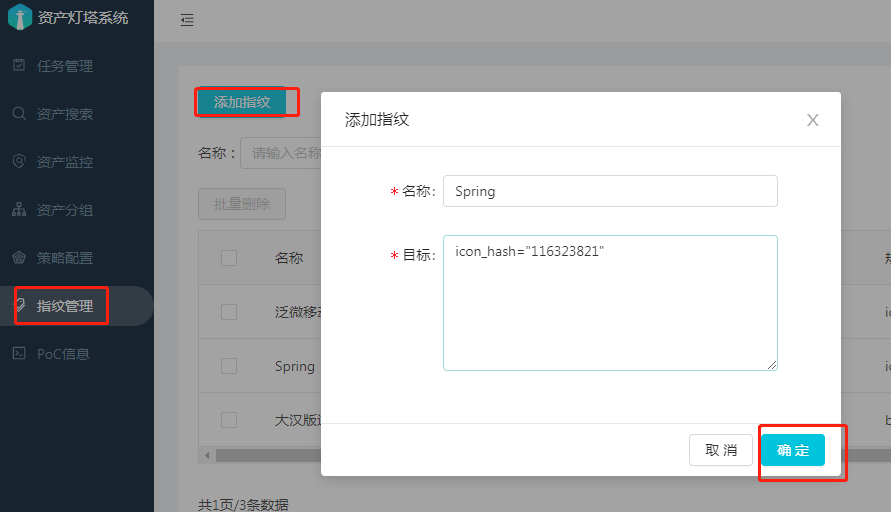
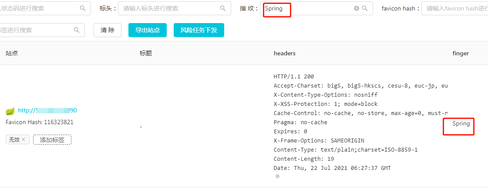

#### 1. 指纹规则语法说明

支持`body`, `title`, `header`, `icon_hash` 四个字段, 可以用`（）`进行分组

支持的操作符有 `=`, `==`, `&&`, `||`, `!`

如 `body="Powered by WordPress" || body="<meta name=\"generator\" content=\"WordPress"`

| 操作符       | 说明                               | 举例                   |
| ------------ | ---------------------------------- | ---------------------- |
| =       |     字符串是否包含         | body = "test"  |
| ==     | 字符串是否相等             | title == "登录" |
| &&       | 判断两个值是否都为真               | body = "test1" && body = "tes2" |
| &#x7c;&#x7c;  |  判断两个值是否至少有一个为真               | body = "test1" &#x7c;&#x7c; body = "tes2" |
| !       | 对一个值进行逻辑非操作               | !(body = "test")   |

#### 2. 指纹添加

在指纹管理界面可以通过`添加指纹`按钮进行指纹的添加

最后效果将在指纹字段显示，也可以通过该字段进行筛选

#### 3. 指纹导入和导出

在指纹管理界面可以通过`指纹导出`和`上传指纹`按钮进行指纹的导入和导出

指纹导入和导出的格式为`yml`格式。
