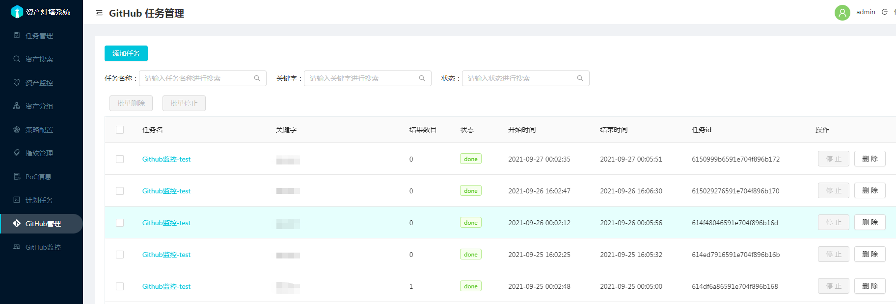
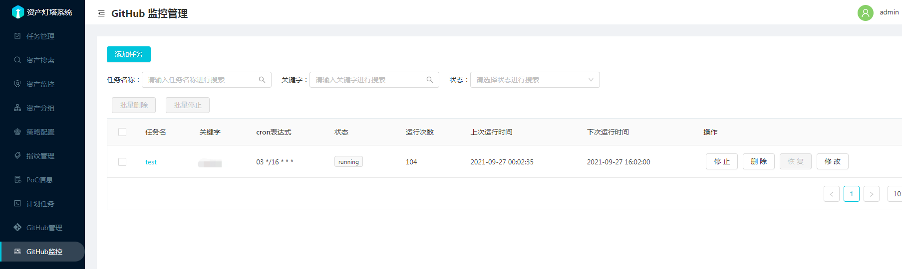

为了使用这个功能需要先在 `docker/config-docker.yaml` 配置GitHub Token。

登录GitHub , 访问`https://github.com/settings/tokens` 

点击 `Generate new token` 按钮，过期时间可以选择`No expiration`

这里只是用来搜索，权限可以不勾选。

#### 1. GitHub 任务管理

添加任务输入相应的关键字，等待任务运行完成，可以点击任务查看运行结果

#### 2.GitHub 监控管理

添加监控任务，输入相应的关键字，一般为内网域名，根据自身需求输入相应的Cron表达式即可。

