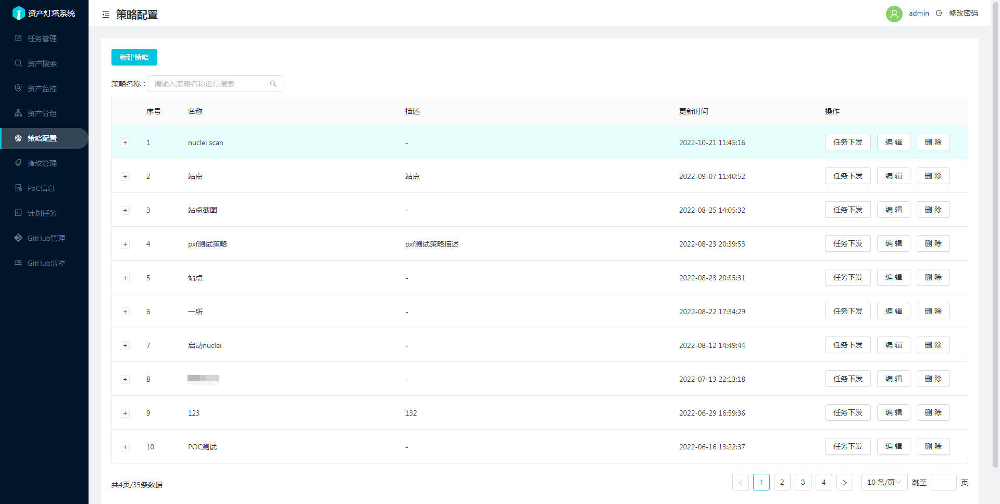

策略配置页面可以进行新建策略操作，和对指定的策略进行任务下发，编辑，删除操作。

1. 新建策略操作，点击新建策略按钮可以对策略进行添加。添加成功后可以方便下一次的任务下发。

2. 任务下发操作，任务下发类型可以选择资产侦查任务和风险巡航任务，其中风险巡航任务不会进行域名爆破和端口扫描，目标一般为URL。资产侦查任务目标一般为主域名或IP段

3. 编辑操作，可以对策略进行编辑，用来修改策略内容。

4. 删除操作，可以删除指定的策略，将会删除记录。

