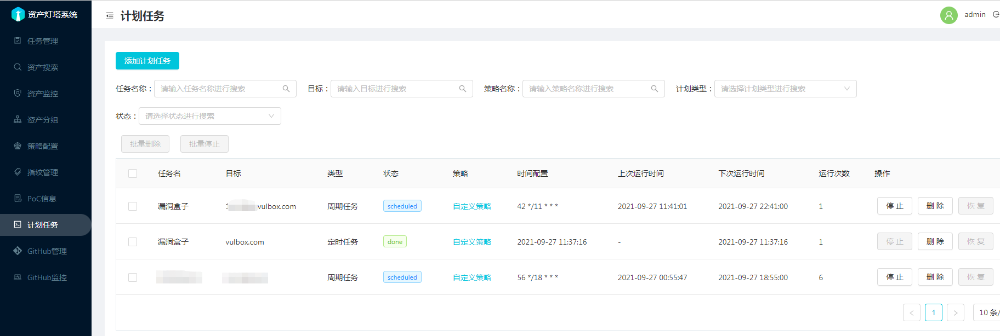

可以在计划任务模块中添加定时任务和周期任务，定时选择指定的时间运行，期间只运行一次。

周期任务采用Cron表达式， 系统限制了最少间隔6小时
 如每天的2点10分触发任务下发（这里不保证任务立即运行，如果队列中有任务将会排队。） 
 
 在计划类型中选择周期任务，在Cron 中填入 `10 2 * * *`， 点击确定进行提交，通过比对下一次运行时间来看Cron 表达式是否和预期的一样。

