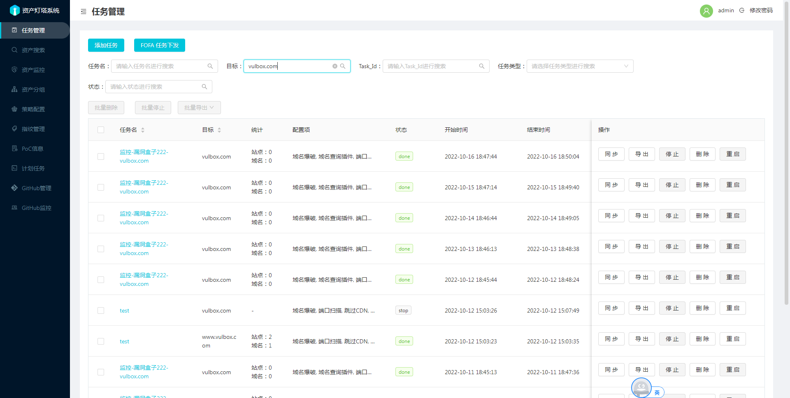
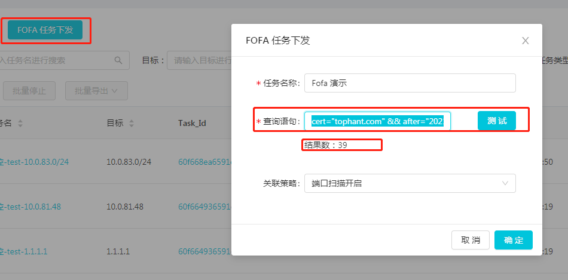

在任务管理界面可以进行资产任务下发和FOFA任务下发。 

1. 任务同步操作，根据扫描目标筛选出资产分组，进行同步时候会将任务数据中新增的域名，IP，站点数据同步到资产分组中。

2. 任务导出操作，将当前任务数据导出为excel表格。

3. 任务停止操作，将当前任务进行停止操作。

4. 任务重启操作，将当前任务重新下发一遍，也就是会启动一个新任务。

5. 任务批量导出操作，可以对任务结果中的站点域名IP等数据进行批量去重导出，导出为txt文本。

####  Fofa任务下发

由于查询API条数限制，需要先在`docker/config-docker.yaml` 里配置 `FOFA` 字段，
可以根据自己的需求针对对每个查询语句配置每页大小和最大页面数量，重启容器生效.

下发任务时直接点击任务管理里的Fofa任务下发

如输入查询语句`cert="tophant.com" && after="2023-01-01"`, 

由于资产过期避免误杀，建议添加时间筛选， 建议点击测试看是否符合预期，选择策略，点击下发即可, 任务执行时只会获取IP当成目标。

#### 域名爆破可以用{fuzz}指定位置

如 下发任务域名为 `abc-{fuzz}.example.com` 那么在爆破时将会`{fuzz}`替换为字典中的内容。

构造域名为`abc-api.example.com`, `abc-m.example.com` 等进行爆破测试。

#### 根据任务结果中的站点、域名、WIH 数量进行筛选

在任务管理界面可以根据任务结果中的站点、域名、WIH 数量进行筛选查询。

先在输入框右侧选择操作逻辑，如：等于、大于、小于。 然后输入数量，点击查询即可。

注：相关字段的数量在任务结束后才会统计。
