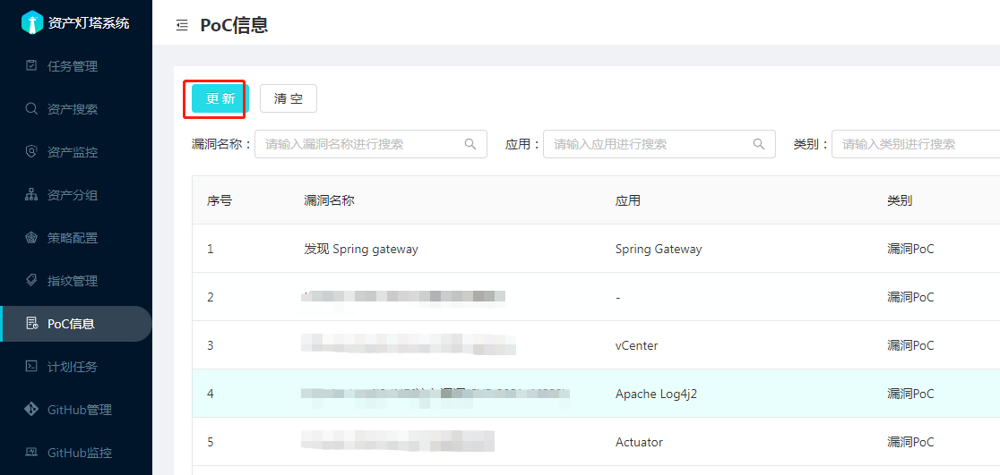
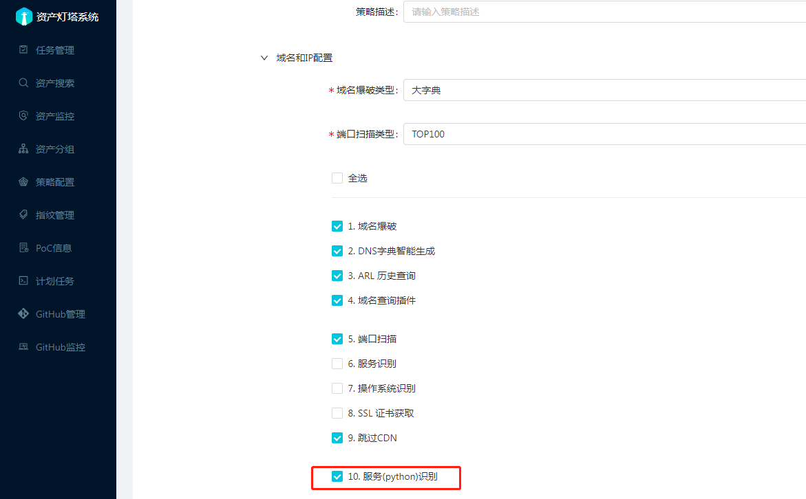
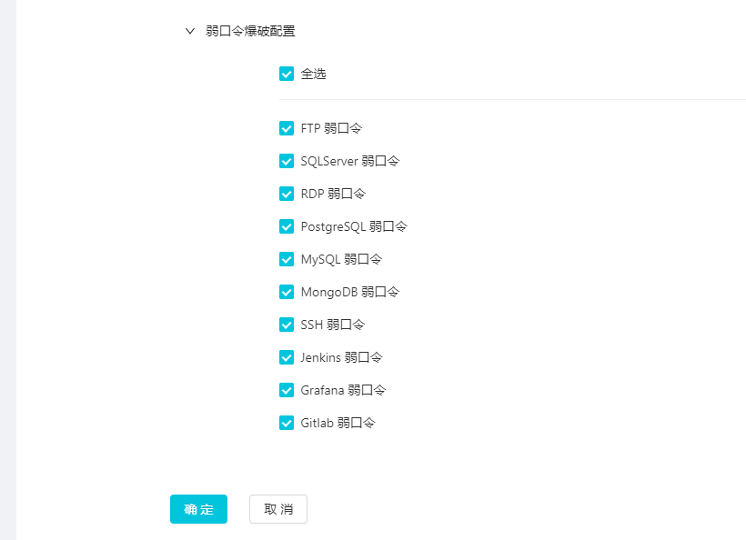
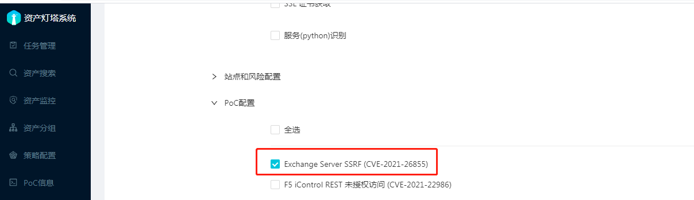
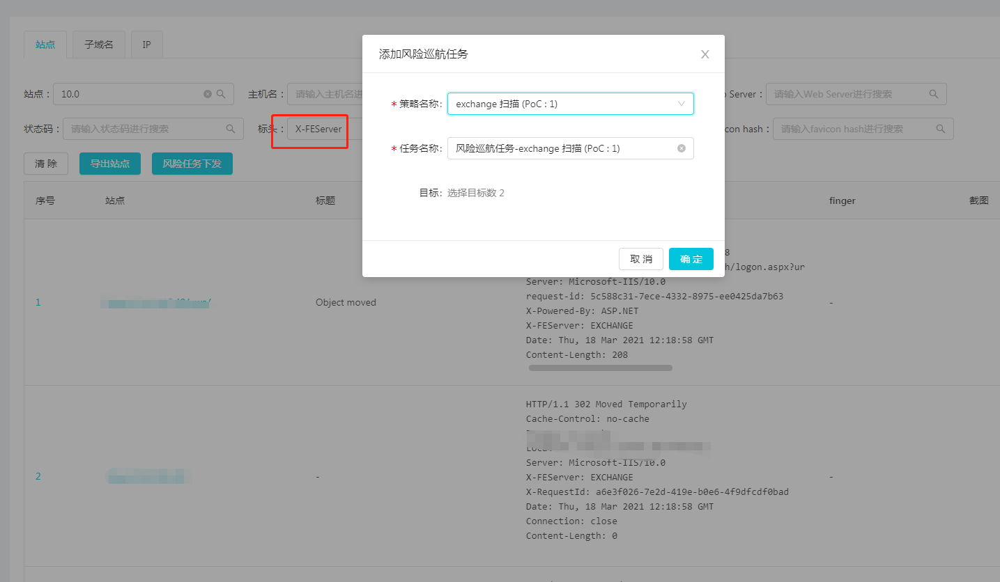
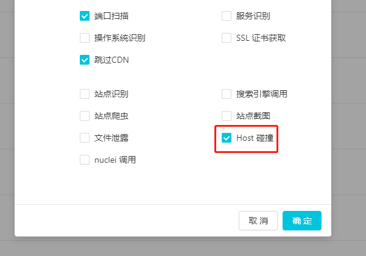
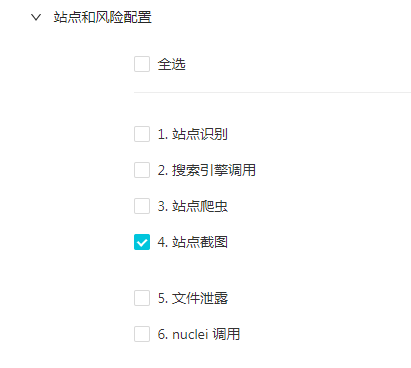
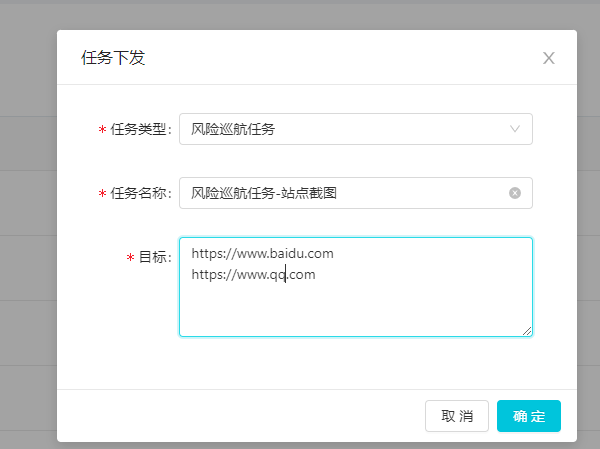

### 1. 添加自定义PoC
为了对通用应用漏洞进行扫描，灯塔中使用了个名为NPoC的框架

框架存放的PoC目录为 xing/plugins, 框架会动态加载该目录下的文件

可以按照自己的需求在目录中添加相应的PoC代码文件， 注意不同子目录下的文件名不要出现重复情况。

由于运行环境为docker, 可以将写好的PoC代码文件放置到`docker/poc`目录下面，将会映射到docker 中的路径 `/opt/ARL-NPoC/xing/plugins/upload_poc`

点击灯塔后台系统中的【PoC信息】-【更新】即可查看到添加到框架中的PoC信息， 然后可以通过配置策略用于扫描。
 
 在管理页面上点击更新按钮，如果没有出现在页面上请查看日志看是否出现报错。

### 2. 对内网IP段进行绕口令爆破
先进入【策略配置】【新建策略】输入名称【弱口令扫描】 域名和IP配置 。

可以根据自己的需要配置， 另外请务必勾选 【服务(python)识别】

【站点配置】这里保持默认， 【弱口令爆破配置】这里点击全选，然后点击确定

在刚刚添加的策略上点击【任务下发】，任务类型，选择资产侦查任务，目标可以填C段

在运行过程中会进行端口扫描，服务识别，然后根据匹配的协议进行弱口令爆破。

目前不支持配置字典，相关的默认字典在容器内路径为`/opt/ARL-NPoC/xing/dicts`

也可以到下面的链接查看 [https://github.com/1c3z/ARL-NPoC/tree/master/xing/dicts](https://github.com/1c3z/ARL-NPoC/tree/master/xing/dicts)

### 3. 对流行漏洞进行应急响应
先进入【策略配置】【新建配置】输入名称【exchange 扫描】 

域名和IP配置 可以根据自己的需要配置, 这里保持默认

【PоC配置】勾选 Exchange 漏洞

进入【资产搜索】点击站点，根据观察，发现Exchange服务的header都会出现X-FEServer字样

在标头输入筛选条件 X-FEServer， 可以快速将Exchange筛选出来，点击风险任务下发。

### 4. Host 碰撞检测功能
有时公网的Nginx等WEB服务器会通过Host来判断代理到不同的站点，当改Host为内网域名时且可以访问被认为存在问题。 

在检测该风险时任务中的公网IP进行访问时，Host会被设置为任务中的内网域名，如果被判定为访问成功，将会检出风险。 为了提高准确度会对结果进行去重，如果发现目标IP存在该问题，不要忘记用Burp手动尝试下，也许会有意外发现。

添加任务时勾选Host碰撞选项框即可启用该功能。

仅仅对域名任务有效，如果任务中公网IP和内网域名比较多的话，可能消耗的时间比较多（可以晚上跑）。

### 5.导入自己收集的资产并对其截图的功能
首先通过策略配置-新建策略，在站点和风险配置中勾选站点截图功能并保存，当然勾选了其他的也会生效

再通过策略下发任务，任务类型勾选风险巡航任务，目标输入URL列表，点击确定下发即可

### 6. 对SRC 域名资产进行资产监控

先收集SRC主域名列表，可以使用企查查，天眼查，站长之家等根据备案信息收集。

再新建资产分组，类别选择域名，资产范围填入收集的主域名列表

新建策略配置，默认选项就好，最好的资产组配置选项选择前面新建的资产分组

通过新建的策略下发任务，类型选择资产侦查任务，为了保证自动化收集效果可以下发两遍。

待前面的任务完毕，在资产分组操作中选择添加监控任务，域名可以全选，时间的可以根据情况来选择，如48小时。

另外为了提高收集效果可以为域名查询插件选项的数据源配置相应的Token。

自动化的收集难免有缺陷，可以在资产分组域名Tab页面中添加缺失的子域名。

