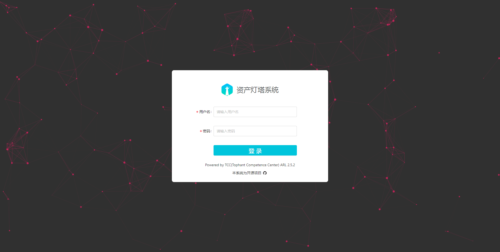
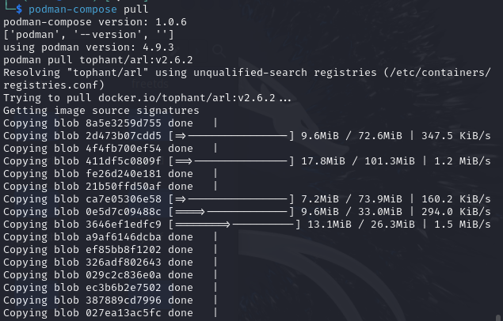
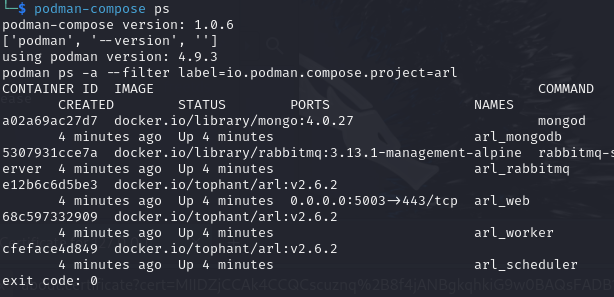

在开始使用之前，请务必阅读并同意 [免责声明] 中的条款，否则请勿下载安装使用本系统。

  [免责声明]: disclaimer.md

### 系统要求

目前暂不支持Windows，初次体验可采用Docker方式运行，长期使用建议采用源码安装方式运行。系统配置建议：CPU:4线程 内存:8G 带宽:10M。  
由于自动资产发现过程中会有大量的的发包，建议采用云服务器可以带来更好的体验。


### Docker 环境安装ARL

#### 1. docker 依赖安装

Ubuntu 下可以直接执行 `apt-get install docker.io docker-compose -y` 安装相关依赖。

Centos 7 可以执行下面的命令安装相关依赖
```
yum install -y yum-utils
yum-config-manager \
    --add-repo \
    https://download.docker.com/linux/centos/docker-ce.repo
yum install docker-ce docker-ce-cli containerd.io docker-compose-plugin
systemctl enable docker
systemctl start docker
```
其他操作系统可以访问官方文档 [https://docs.docker.com/engine/install/](https://docs.docker.com/engine/install/)

#### 2. ARL安装和启动
```
cd /opt/
mkdir docker_arl
wget -O docker_arl/docker.zip https://github.com/TophantTechnology/ARL/releases/download/v2.6.2/docker.zip
cd docker_arl
unzip -o docker.zip
docker compose pull
docker volume create arl_db
docker compose up -d
```

### Docker 环境卸载
```shell
docker compose down
docker rmi tophant/arl:v2.6.2
docker volume rm arl_db （不执行这个可以保留mongo中的数据）
```

再删除当前目录的文件就可以。


### 源码安装

#### 1. Centos 7 下源码安装
仅仅适配了 centos 7 ，且灯塔安装目录为/opt/ARL 如果在其他目录可以创建软连接，
且安装了四个服务分别为`arl-web`, `arl-worker`, `arl-worker-github`, `arl-scheduler`
```
wget https://raw.githubusercontent.com/TophantTechnology/ARL/master/misc/setup-arl.sh
chmod +x setup-arl.sh
./setup-arl.sh
```

#### 2. 服务管理

```
/opt/ARL/misc/manage.sh
Usage: manage.sh [ stop | start | status | restart | disable | enable | log ]
```

###  访问 ARL 系统

注意协议是HTTPS, 管理端口为5003
URL：https://127.0.0.1:5003
密码： admin/arlpass




### podman 环境安装 ARL 参考

#### 0. 操作系统环境

kali-linux-2024.1

#### 1. podman 依赖安装

安装相关依赖。
```yaml
sudo apt-get update
sudo apt-get -y install podman podman-compose
```

其他操作系统可以访问官方文档 [https://podman.io/docs/installation](https://podman.io/docs/installation)


#### 2. 指定默认的镜像仓库
修改文件 `/etc/containers/registries.conf`
添加下面的内容
```
[registries.search]
registries = ['docker.io']
```

#### 3. 下载docker.zip 配置文件
```
cd ~
mkdir docker_arl
wget -O docker_arl/docker.zip https://github.com/TophantTechnology/ARL/releases/download/v2.6.2/docker.zip
cd docker_arl
unzip -o docker.zip
```

#### 4. worker 容器添加 NET_RAW 权限

解决 nmap 报错 `Couldn't open a raw socket. Error: Operation not permitted`
nmap 在扫描端口的时候需要 NET_RAW 权限，

修改 docker-compose.yml 给 worker 容器添加权限
```yaml
    cap_add:
      - NET_RAW
```


#### 5. 启动运行
```
podman-compose pull
podman volume create arl_db
podman-compose up -d
```

podman-compose pull 截图




podman-compose ps 截图


